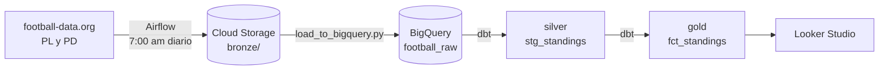

# Football Data Pipeline: La Liga y Premier League


Pipeline que todos los días baja la tabla de posiciones y los partidos de La Liga y la Premier League desde la API de [football-data.org](https://www.football-data.org/), los guarda en Google Cloud, los transforma con dbt en BigQuery y los muestra en un dashboard de Looker Studio.

Lo hice para practicar un flujo completo en la nube, con un data lake por capas (bronze, silver y gold) y cargas que se pueden repetir sin duplicar datos.

**Dashboard en vivo:** [Looker Studio](https://datastudio.google.com/reporting/429d9a0c-fa02-4608-86a9-b8e1cd533fe0)

## Cómo funciona



1. **Extracción (Airflow).** El DAG `football_pipeline` corre a las 7:00 am. Extrae la Premier League (`PL`) y La Liga (`PD`) en paralelo porque no dependen una de la otra, y guarda el JSON crudo en `bronze/{liga}/{fecha}/` dentro del bucket.
2. **Validación.** Antes de seguir, una tarea revisa que existan los cuatro archivos del día (standings y matches de cada liga). Si falta alguno, el DAG falla ahí y no llega nada incompleto a BigQuery.
3. **Carga a BigQuery.** `data/load_to_bigquery.py` lee el JSON de GCS y lo inserta en `football_raw.standings`. Antes de insertar borra lo que ya exista de esa liga y esa fecha, así que si la corro dos veces el resultado es el mismo.
4. **Transformación (dbt).** `stg_standings` limpia y tipa los datos (silver) y `fct_standings` calcula las métricas del dashboard (gold).

## Por qué lo armé así

- **Capas bronze, silver y gold:** el JSON original se queda intacto en bronze. Si encuentro un error en una transformación, puedo reprocesar cualquier día sin volver a llamar a la API.
- **Carga idempotente:** `DELETE` + `INSERT` por liga y fecha. Los reintentos de Airflow no generan duplicados.
- **dbt para el SQL:** las transformaciones quedan versionadas y con tests. Si un test falla, los datos malos no llegan al dashboard.
- **Extracción en paralelo:** las dos ligas se bajan al mismo tiempo, y el tiempo total queda en lo que tarda la más lenta.

## Qué calcula la capa gold

`fct_standings` agrega a cada equipo:

| Métrica | Cómo se calcula |
|---------|-----------------|
| `win_percentage` | victorias / partidos jugados |
| `avg_goals_scored` / `avg_goals_conceded` | goles a favor y en contra por partido |
| `points_per_game` | puntos / partidos jugados |
| `team_form` | Excelente (≥ 2.0 pts/partido), Bueno (≥ 1.5), Regular (≥ 1.0) o Malo |
| `champions_league_spot` | posición ≤ 4 |
| `relegation_zone` | posición ≥ 18 |

### Tests de dbt

7 tests sobre `stg_standings`: `team_id` (`unique` y `not_null`), `competition_code` (`not_null` y `accepted_values`), y `not_null` en `points`, `played_games` y `position`.

## Cómo correrlo

Necesitas Docker, Python 3.12+, un proyecto de GCP con BigQuery y Cloud Storage, y una API key gratuita de football-data.org.

```bash
git clone https://github.com/SaidHoffman/Pipeline-LaLiga---Premier-Ligue.git
cd Pipeline-LaLiga---Premier-Ligue

python -m venv venv
source venv/bin/activate
pip install -r requirements.txt

cp .env.example .env        # API key, proyecto de GCP, bucket y datasets

gcloud auth application-default login --no-launch-browser

docker compose up airflow-init
docker compose up airflow-webserver airflow-scheduler -d
```

Abre <http://localhost:8080>, activa el DAG `football_pipeline` y dale *Trigger DAG*. Después carga a BigQuery y corre dbt:

```bash
python data/load_to_bigquery.py

cd dbt/football
dbt run  --profiles-dir .
dbt test --profiles-dir .
```

## Estructura

```
├── dags/football_pipeline.py     # DAG: extracción PL y PD en paralelo + validación
├── data/
│   ├── extract_football.py       # API → Cloud Storage (bronze)
│   └── load_to_bigquery.py       # Cloud Storage → BigQuery (idempotente)
├── dbt/football/models/
│   ├── silver/stg_standings.sql  # limpieza y tipado + tests
│   └── gold/fct_standings.sql    # métricas para el dashboard
└── docker-compose.yml            # Airflow 2.8 + PostgreSQL
```

## Siguientes pasos

- Meter la carga a BigQuery y `dbt run` / `dbt test` como tareas del mismo DAG, para que todo corra solo de principio a fin.
- Modelar también los partidos (`matches.json`), que ya se guardan en bronze pero todavía no se transforman.
- Agregar más ligas; el código ya recibe el código de competición como parámetro.

---

**Said Sigala Morales** · [Portafolio](https://said-sigala.netlify.app/) · [LinkedIn](https://www.linkedin.com/in/saidsigala)
